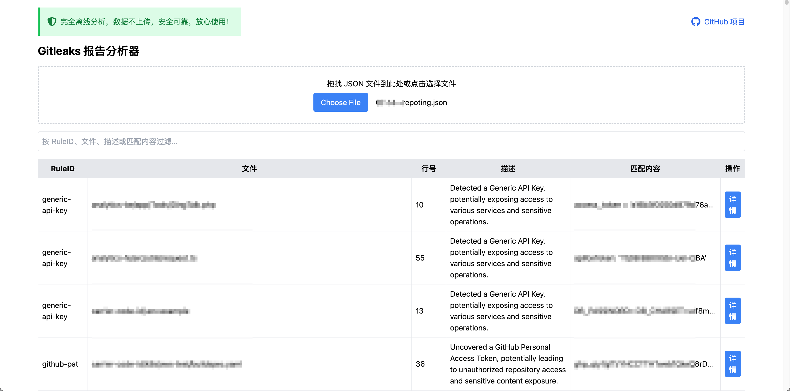

# Gitleaks report analyzer
Gitleaks Report Analyzer (Offline) / Gitleaks 报告分析工具 (离线运行)

Gitleaks 报告分析器是一个简单易用的网页工具，专门用来查看和分析 Gitleaks 生成的 gitleaks-report.json 文件。这个文件记录了代码中可能泄露的敏感信息（如密钥、密码等）。我们的工具让你轻松上传文件，查看结果，快速找到问题，保护代码安全。
项目完全在浏览器中运行，数据不上传到任何服务器，非常安全。

在线演示链接（Demo）：https://gitleaks-report-analyzer.pages.dev

